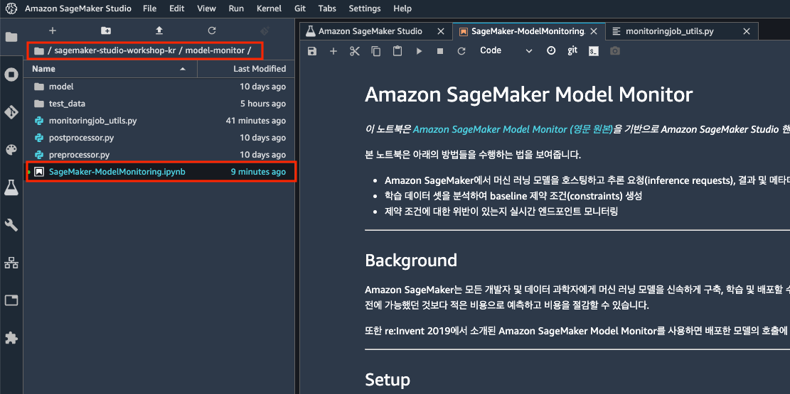
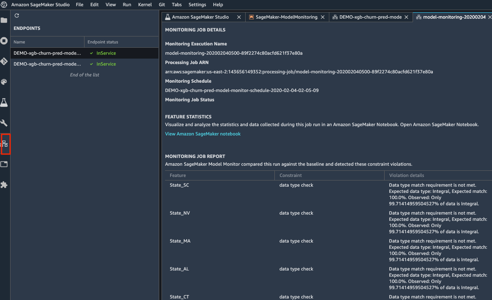

# Module 4. Amazon SageMaker Model Monitor

이 모듈에서는 Amazon SageMaker Model Monitor 기본 사용법을 Churn Prediction 데이터셋으로 실습해 보겠습니다. 여러분은 본 실습을 통해 아래 사항들을 다루게 됩니다.
- 엔드포인트(Endpoint)에서 실시간 추론(inference) 데이터 캡처
- 캡처된 데이터 확인 방법
- 학습 데이터셋으로 기준(baseline) 작업 생성
- 모니터링 일정 생성 및 모니터링<br>

참고로, 본 모듈의 실습 시간은 약 30분이 소요됩니다.

### 목차
- Step 1. Amazon SageMaker Model Monitor 개요
- Step 2. Amazon SageMaker Model Monitor 체험하기
<br>

## Step 1. Amazon SageMaker Monitor Monitor 개요
---
### 특징

- 엔디포인트로 전송되는 입력 데이터 및 모델 추론(inference) 결과와 메타데이터를 캡처할 수 있으며, 캡처 결과는 S3에 저장됩니다.
- 학습 데이터로부터 실시간 트래픽을 비교할 기준(baseline)을 생성 후, 테스트 데이터를 기준선과 지속적으로 비교할 일정(schedule)을 설정 및 실행함으로써 데이터 드리프트를 쉽게 모니터링할 수 있습니다.
- Amazon SageMaker Studio에서도 모니터링 결과를 확인할 수 있으며, 자동으로 모니터링 보고서 Juputer notebook이 생성되므로 모니터링 결과의 시각화 및 추가 분석이 가능합니다.

### Code snippets
- 추론 데이터 캡처 예시
```python
from sagemaker.model_monitor import DataCaptureConfig

data_capture_config = DataCaptureConfig(
    enable_capture=True,
    sampling_percentage=100,
    destination_s3_uri='s3://path/for/data/capture'
)

predictor = model.deploy(
    ...,
    data_capture_config=data_capture_config
)
```

- 기준(Basline) 생성 예시
```python
from sagemaker.model_monitor import DefaultModelMonitor
from sagemaker.model_monitor.dataset_format import DatasetFormat

my_monitor = DefaultModelMonitor(
    role=role,
    instance_count=1,
    instance_type='ml.m5.xlarge',
    volume_size_in_gb=20,
    max_runtime_in_seconds=3600,
)

my_monitor.suggest_baseline(
    baseline_dataset='s3://path/to/training-dataset-with-header.csv',
    dataset_format=DatasetFormat.csv(header=True),
)
```

- 일정(Schedule) 생성 예시
```python
from sagemaker.model_monitor import CronExpressionGenerator

my_monitor.create_monitoring_schedule(
    monitor_schedule_name='my-monitoring-schedule',
    endpoint_input=predictor.endpoint,
    statistics=my_monitor.baseline_statistics(),
    constraints=my_monitor.suggested_constraints(),
    schedule_cron_expression=CronExpressionGenerator.hourly(),
)
```

자세한 내용은 [Model Monitor Developer Guide](https://docs.aws.amazon.com/sagemaker/latest/dg/model-monitor.html)와
[Model Monitor API Reference](https://sagemaker.readthedocs.io/en/stable/amazon_sagemaker_model_monitoring.html)를 참조하세요.


## Step 2. Amazon SageMaker Model Monitor 체험하기
---

실습을 위해서 현재 설치되어 있는 SageMaker의 Jupyter 노트북의 예제들 중 아래의 디렉토리에 위한 Jupyter 노트북을 실행하시면 됩니다.<br>
`/sagemaker-studio-workshop-kr/model-monitor/SageMaker-ModelMonitoring.ipynb`

참고로, 관련 파일들의 tree 구조는 아래와 같으며, 본 step의 실습 시간은 약 20분~25분이 소요됩니다.

```
├── SageMaker-ModelMonitoring.ipynb: Jupyter notebook 파일
├── model
│   └── xgb-churn-prediction-model.tar.gz: 사전 학습된 모델
├── postprocessor.py: 후처리 핸들러 (Optional)
├── preprocessor.py: 전처리 핸들러 (Optional)
└── test_data
    ├── test-dataset-input-cols.csv: 테스트 데이터셋
    ├── test-dataset.csv: 테스트 데이터셋(본 워크샵에서는 사용하지 않습니다.)
    ├── test_sample.csv: 테스트셋 샘플 데이터(데이터 캡처 테스트용)
    ├── training-dataset-with-header.csv: 규칙을 생성할 학습 데이터셋(헤더 있음)
    ├── training-dataset-without-header.csv: 규칙을 학습 데이터셋(헤더 없음, 본 워크샵에서는 사용하지 않습니다.)
    └── validation.csv: 검증 데이터셋(본 워크샵에서는 사용하지 않습니다.)
```


**<center>Figure 1. Juypyter notebook 예제 코드.</center>**    

참고로, Code cell을 실행하려면 `Figure 1.`을 참조하여 실행 버튼을 클릭하거나, 키보드 단축키
`Control+Enter`나 `Shift+Enter`를 실행합니다. 참고로 본 핸즈온 랩은 실제 사용하는 실행 후 Cell을 이동하는 `Shift+Enter` 단축키를 권장합니다.


**<center>Figure 2. Code cell 실행 화면.</center>** 

Note: 원활한 워크샵의 진행을 위해, 모니터링 수행에 필요한 Code cell들은 주석 처리하였습니다.
실제 엔드포인트상에서 모니터링을 수행하게 되면, SageMaker Studio 창에서 `Figure 3.`과 같이 모니터링 결과를 쉽게 확인할 수 있습니다.


**<center>Figure 3. 모니터링 결과 확인 화면.</center>** 

수고하셨습니다. 이상으로 본 모듈의 실습 과정을 마무리 하셨습니다. 워크샵 이후 발생되는
비용을 방지하기 위해 서비스 종료 가이드를 통해 사용하신 리소스들을 모두 종료/삭제 해주십시오.