# Module 1. Getting Started with Amazon SageMaker Studio

이 모듈에서는 Amazon SageMaker Studio IDE(Integrated Development Environment)를 시작해 봅니다. 실습 시간은 약 10분 소요됩니다.

### 목차
- Step 1. Concepts
- Step 2. Amazon SageMaker Studio 시작하기

<br>

## Step 1. Concepts
---
본 실습에 들어가기 전에, Amazon SageMaker Studio의 주요 컨셉을 살펴보도록 하겠습니다.

#### Studio Domain
- VPC(Virtual Private Cloud) Config 및 기본 IAM(Identity and Access Management) Execution Role과 같은 권한이 부여된 사용자 및 보안 구성 목록입니다.
- 리전 당 하나의 도메인으로 제한됩니다.
#### User profile
- 각 user profile에는 공유 EFS(Amazon Elastic File System)가 있는 자체 전용 컴퓨팅 리소스가 있습니다. 즉, 기본 스토리지로 EFS를 사용합니다.
- 각 user profile은 Execution Role과 연결될 수도 있습니다.
#### Auth modes
- AWS SSO(Single Sign-On): 사용자는 AWS 콘솔과 상호 작용할 필요가 없습니다.
- AWS IAM(Identity and Access Management)

## Step 2. Amazon SageMaker Studio 시작하기
---

1. AWS [관리 콘솔](https://console.aws.amazon.com/console/home)에 Sign in 합니다. 만약 AWS 측에서 Event Engine을 사용하여 임시 아이디를 생성한 경우, 제공 받으신 URL(https://dashboard.eventengine.run/)을 여시고 Team Hash code를 입력하시면 됩니다.

1. 리전(Region)이 `서울(Seoul)`로 되어 있는지 확인합니다. 만약 다른 리전으로 설정되어 있다면, `서울(Seoul)`로 변경해 주세요. (`Figure 1.` 참조)

    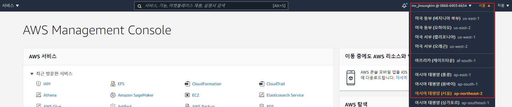
    **<center>Figure 1. 리전 확인.</center>**    

1. Amazon SageMaker 서비스 페이지로 이동합니다. (`Figure 2.` 참조)

    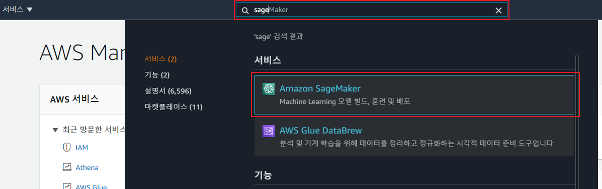
    **<center>Figure 2. Amazon SageMaker.</center>**     

1. Figure 3.을 참조하여 `Amazon SageMaker Studio` 메뉴 클릭 후 우측의 `표준 설정(Standard Setup)` 라디오 버튼 클릭 후 `AWS Identity and Access Management(IAM)` 라디오 버튼을 클릭하세요. 참고로, SSO(Single Sign-On)으로 AWS 콘솔 접근 없이 곧바로 Amazon SageMaker Studio에 접속 가능하지만, 본 핸즈온에서는 원활한 실습을 위해 IAM(Identity and Access Management)으로 실습하겠습니다.

    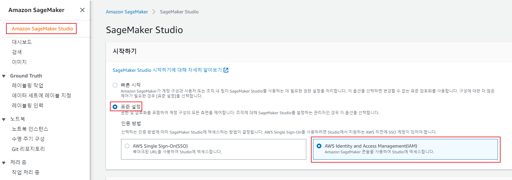
    **<center>Figure 3. Start with IAM.</center>**    

1. Permission 항목의 Execution role for all users에서 `Figure 4.`처럼 `새 역할 생성(Create a new role)`을 선택하고, 생성된 팝업 창에서는 `Figure 5.`처럼 지정하는 S3 버킷 - 선택 사항 (S3 buckets you specify – optional) 밑에 `모든 S3 버킷(Any S3 Bucket)` 을 선택합니다. 이후 팝업 창 우측 하단의 `역할 생성(Create role)` 버튼을 클릭합니다.
    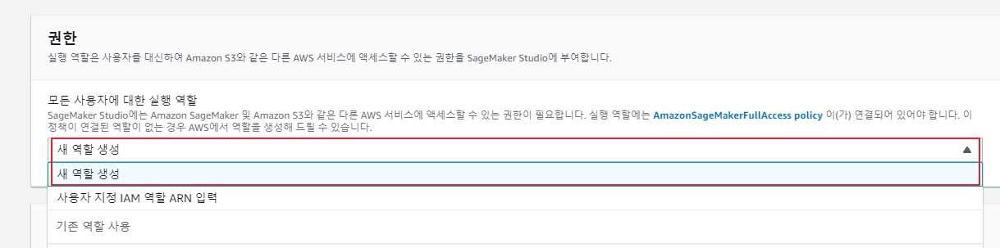

    **<center>Figure 4. Execution role.</center>**  

    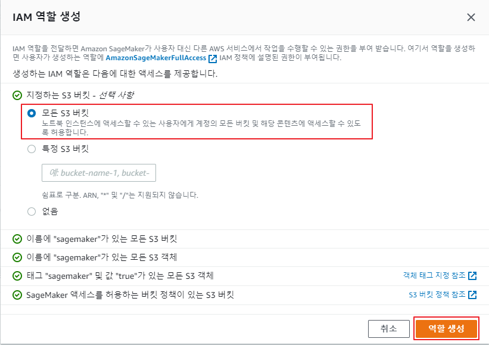
    **<center>Figure 5. Role 추가.</center>**    

1. 노트북 공유 구성(Notebook resource configuration - optional)을 클릭한 뒤, 공유 가능한 노트북 리소스(Shareable notebook resource)에서 노트북 리소스 공유 활성화(Enable notebook resource sharing)이 활성화되었는지 확인하고, 공유 가능한 노트북 리소스의 S3 위치(S3 location for sharable notebook resource)에 `s3://sagemaker-studio-[YOUR-OWN-NAME]/sharing`을 입력합니다. (`Figure 6.` 참조)

    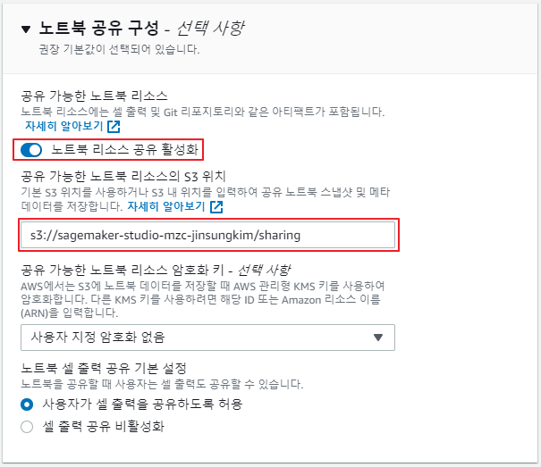
    **<center>Figure 6. S3 bucket 설정.</center>**    

1. 모든 설정이 완료되었다면 우측 하단의 `Submit` 버튼을 클릭하세요.

1. Amazon SageMaker Studio Control panel 에서 Studio ID(Domain ID)가 정상적으로 생성되었는지 확인하고, Status가 `Pending`에서 `Ready`로 변경될 때까지 기다립니다(약 4~5분 소요). 이후 `Figure 7-1.` 처럼 `Ready`로 변경되었다면 우측 상단의 `사용자 추가(Add user)` 버튼을 클릭합니다. (`Figure 7.`, `Figure 7-1.` 참조)

    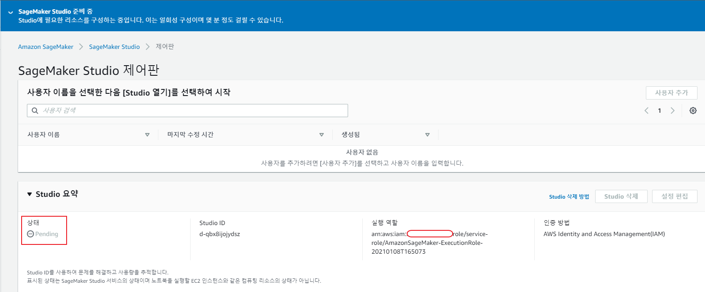
    **<center>Figure 7. Studio ID(Domain ID) 생성 중.</center>**    

    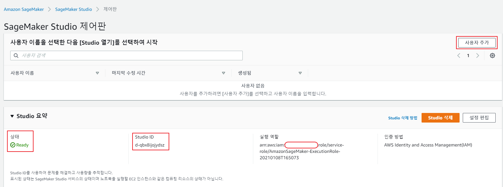
    **<center>Figure 7-1. Studio ID(Domain ID) 생성 완료.</center>**        

1. `Figure 8.`처럼 Amazon SageMaker Studio 제어판(Control Panel)의 사용자 이름(User name) 입력란에 `[YOUR-OWN-NAME]-hol`(예: mzc-jinsungkim-hol)을 입력 후, `전송(Submit)` 버튼을 클릭합니다.

    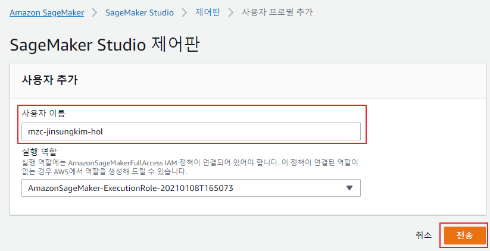
    **<center>Figure 8. 사용자 프로필 추가.</center>**    

1. Amazon SageMaker Studio 제어판(Control Panel) 화면에서 사용자(User)가 등록되었는지 확인 후, 우측의 `Studio 열기(Open Studio)` 버튼을 클릭합니다.

    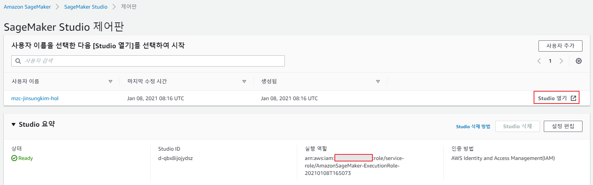
    **<center>Figure 9. Open Amazon SageMaker Studio.</center>**    

1. `Figure 10.`의 화면이 출력되면서 JupyterServer를 로딩합니다. 이 과정은 평균적으로 약 2-3분 소요됩니다. 만약 5분 경과 이후에도 `Figure 11.`의 화면으로 넘어가지 않으면, 핸즈온랩 진행자나 서포터들에게 문의해 주세요.

    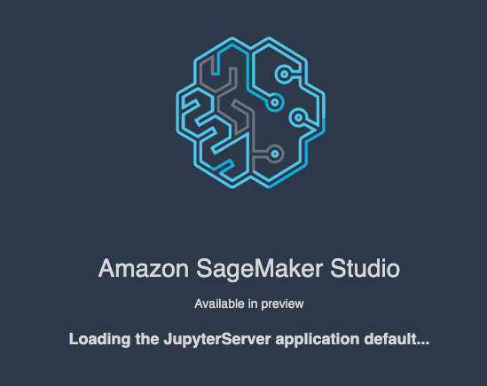
    **<center>Figure 10. Amazon SageMaker Studio 시작.</center>**    

    
    **<center>Figure 11. Amazon SageMaker Studio 초기 화면.</center>**    

1. 핸즈온에 필요한 코드를 GitHub에서 다운로드합니다. 상단 메뉴의 `Git`-` Initilize a Repository`를 클릭하여 Git Repo에 대한 초기화를 수행하신 뒤 `Git`- `Git Command in Terminal`을 클릭하여 터미널(terminal)로 접속합니다. (`Figure 12.` , `Figure 12-1.` 참조)

     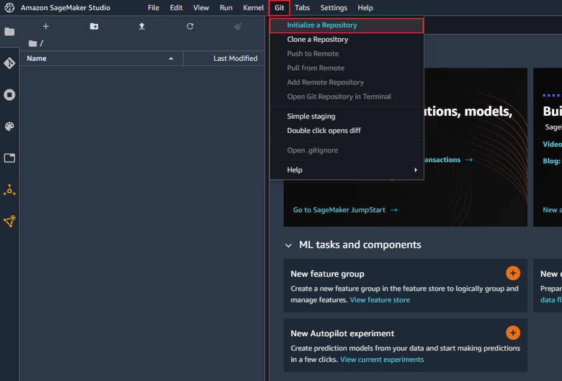
     **<center>Figure 12. Initialize a Repository.</center>**  

     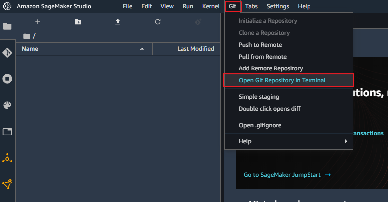
     **<center>Figure 12-1. Open Git Repository in Terminal.</center>**  

     터미널 화면에서 아래 명령어를 복사 후 붙여넣기 후 엔터(Enter)키를 치면 코드 다운로드가 완료됩니다. 다운로드가 정상적으로 완료되었다면, 좌측 화면에 
     `sagemaker-studio-workshop-kr-jinsung` 폴더가 나타납니다. (`Figure 13.` 참조)

      ```
      git clone https://github.com/tweety0201/sagemaker-studio-workshop-kr-jinsung.git
      ```
      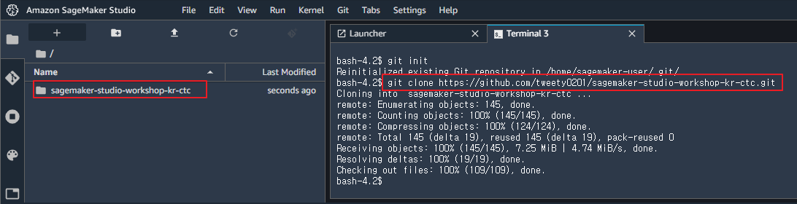
      **<center>Figure 13. 핸즈온 코드 다운로드 완료 화면.</center>**    

1. `Figure 13.`의 `sagemaker-studio-workshop-kr-jinsung` 폴더를 더블클릭하여 관련 파일과 폴더들이 정상적으로 생성되었는지 확인합니다. (`Figure 14.` 참조)

    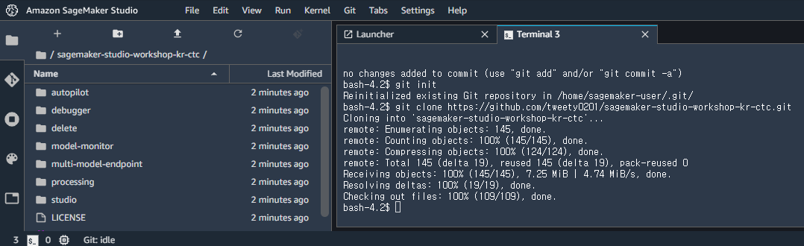
    **<center>Figure 14. 핸즈온 코드.</center>**    

수고하셨습니다. 모듈 1을 완료하였습니다.
